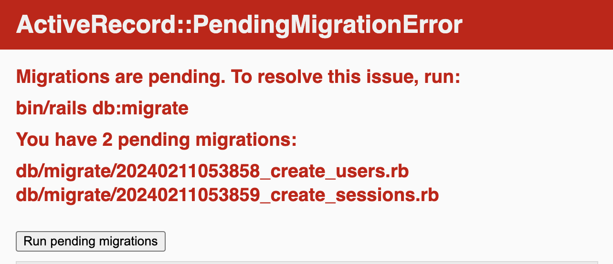

60% of success in any project lies in a good start, and it's often the trickiest part, isn't it?
In this post, I'll provide a step-by-step guide to setting up a Ruby on Rails project, including which gems to add and essential information to know about Ruby on Rails. I decided to create this blog post because, while attempting to bootstrap my RoR project following other guides, I observed that many developers recommend outdated tools and a cumbersome setup process. I appreciate simplicity and prefer scaling my app gradually. I hope you find this guide helpful. Let's get started!

## Why Ruby on Rails

Ruby on Rails is an amazing, "batteries included" framework with a comprehensive ecosystem, similar to Laravel. Due to its **_opinionated_** nature,
you won't struggle with decisions like choosing gems or structuring your project.
A significant difference is that Ruby on Rails is a **_monolith_**
framework, meaning it includes everything you need to build a web application. It boasts a built-in ORM, routing, templating engine, authentication, authorization, mailers, and background jobs. However, this convenience comes with a trade-off. Ruby on Rails lacks type checking,
so you'll need to acquaint yourself with **_duck typing 🦆_**. It's not as flexible as the JavaScript ecosystem.

There are things that I potentially love in RoR and why I think it's extremely smart framework:

1. **Frontend Focus**: RoR streamlines backend development,
   allowing developers to focus primarily on crafting user interfaces.

2. **Built-in WebSockets Support**: Action Cable provides seamless
   support for WebSockets without the need for additional setup.

3. **Built-in REST API Support**: Active Model Serializers facilitate
   built-in support for REST APIs.

4. **Convention over Configuration**: The framework follows the
   principle of letting conventions guide decisions, eliminating the need for developers to decide on project
   structure, file placement, and naming conventions. This allows RoR to quickly scaffold components following common patterns.

5. **CLI Installers for Gems**: Unlike the JS ecosystem,
   RoR gems come with CLI installers and generators.
   Instead of following a step-by-step guide for setting up a new library,
   dealing with file creation, configurations, importing dependencies, and setting up related libraries,
   RoR gems include all necessary code that integrates into your project upon installation.
   To set up a Ruby on Rails project, you simply need to know which gems to use.

This was just a preamble and some observations. Now, let's dive in!

## Create new project

> For this guide, I assume you already know how to
> set up Ruby and Ruby and Rails on your machine. I strongly recommend starting any
> development process in a container environment. To set up your container
> properly, I have written a separate blogpost: [**Setting up a devcontainer in VSCode for Ruby on Rails development**](/blog/setting-up-devcontainer-for-ruby-on-rails)

Now we are going to configure our new RoR project using the following gems:

- rubocop
- solargraph
- annotate
- erb-formatter

And I'll also share some additional gems and setup tricks:

- auth: authentication-zero
- social login: omniauth-google-oauth2
- credentials setup
- erb alternative: phlex
- database: SQLite3

Let's start with creating new very simple, minimalistic project. Feel free to remove or add any options:

```bash
rails new [my-project] -c tailwind -d postgresql -J -T -a propshaft --skip-jbuilder --skip-action-mailbox
```

#### -c

Sometimes I use Tailwind CSS as a CSS framework, so I
add the `-c tailwind` option to use it out of the box.
Of course, you can add Tailwind at any time later, but this way,
you will have a designed UI from the very beginning.

#### -d

You can add PostgreSQL as a database, as in the example `-d postgresql`.
However, I personally prefer to use SQLite3 for production because it's lightweight and simple to use.
The **SQLite3 database** is the default database used when a new Ruby
on Rails application is created. This can be changed using the `-d`
or `--database` option with allowed values: `mysql`, `oracle`,
`postgresql`, `sqlite3`, `frontbase`, `ibm_db`, `sqlserver`,
`jdbcmysql`, `jdbcsqlite3`, `jdbcpostgresql`, `jdbc`.

### -J

This option avoid JavaScript installation completely in your project. If you need JS instead, feel free to remove this `-J` now.

### -T

**T** stands for 'skip tests'. If you decide later that you want to add tests to your project, you can do so manually
by adding the necessary testing gems to your Gemfile and generating the test files
using Rails generators or other testing frameworks like RSpec or Minitest.

### -a

**-a** stands for asset pipeline and specifies that you want to use `propshaft` as the asset pipeline for your
Rails application. Propshaft is a new asset pipeline introduced in Rails 7, designed to replace the older
`Sprockets-based` asset pipeline. This change aims to improve the performance and flexibility of
asset handling in Rails applications. So, for now, old Sprockets is the default option, and before Propshaft replaces
it, we'll need to add this option manually every time we create a new project.

When you use the -a propshaft option, Rails will configure your project to use Propshaft for managing assets. This includes:

**Asset Compilation**: Propshaft will compile your assets (CSS, JavaScript, images, etc.) in a more efficient
manner compared to Sprockets.

**Asset Preprocessing**: It supports modern asset preprocessing tools and techniques, allowing for more streamlined
development workflows.

**Improved Performance**: By leveraging modern web standards and optimizations, Propshaft aims to offer better
performance for asset delivery in Rails applications.

### extras

The `--skip-jbuilder` option will skip the installation of the Jbuilder gem.
Jbuilder is a templating engine for JSON, primarily used for crafting complex REST APIs, which I personally don't make.
But once needed, you can add it later to your RoR app.

The `--skip-action-mailbox` option will skip the installation of the Action Mailbox gem in your new project.
Action Mailbox is a framework for routing incoming emails to controller-like mailboxes in a Rails application.
So, you will _still_ have a mailbox in your application to send emails, but you won't be able to receive them.
I don't think this is such a necessary thing to have now, so I normally skip this too, and later you can always
install the Action Mailer gem.

> You can also check commands on RoR guides at
> https://guides.rubyonrails.org/command_line.html or simply call
> `rails new -h` to see all available options.

###

### Rubocop

RuboCop is a static code analyzer that helps to keep your code clean and consistent.
Add the [RuboCop gem](https://github.com/rubocop/rubocop) by
including it in the Gemfile within the **Development group**:

```ruby
gem 'rubocop', require: false
```

Add [rubocop-rails](https://github.com/rubocop/rubocop-rails) to the Gemfile too:

```ruby
gem 'rubocop-rails', require: false
```

After that run bundle command:

```bash
bundle
```

To activate RuboCop, create a file named `.rubocop.yml` in
the root folder and add the following config (or you can setup your own rules, this is just my config I use regularly):

```yml
require:
  - rubocop-rails

AllCops:
  NewCops: enable

Layout/LineLength:
  Enabled: false

Metrics/AbcSize:
  Enabled: false

Metrics/BlockLength:
  Enabled: false

Metrics/ClassLength:
  Enabled: false

Metrics/MethodLength:
  Enabled: false

Rails/I18nLocaleTexts:
  Enabled: false

Rails/OutputSafety:
  Enabled: false

Lint/MissingSuper:
  Enabled: false

Style/Documentation:
  Enabled: false

Style/FrozenStringLiteralComment:
  SafeAutoCorrect: true

Style/MethodCallWithArgsParentheses:
  Enabled: true
```

Install the [Ruby LSP](https://marketplace.visualstudio.com/items?itemname=shopify.ruby-lsp)
extension for VSCode to enable RuboCop integration.
This is the only gem that highlights your Ruby code.

### Solargraph

Solargraph is a language server for Ruby,
offering features such as intellisense, code completion,
and documentation.

Following the analogy with RuboCop,
add [solargraph](https://github.com/castwide/solargraph)
and [solargraph-rails](https://github.com/iftheshoefritz/solargraph-rails/)
to your Gemfile within the **Development group**:

```ruby
gem 'solargraph', require: false
gem 'solargraph-rails', require: false
```

Install the [Ruby Solargraph](https://marketplace.visualstudio.com/items?itemName=castwide.solargraph) extension.

Run bundle command:

```bash
bundle
```

To activate the extension, run `solargraph config` to generate
.solargraph.yml. Add the following lines to this file to instruct your
IDE plugin to use solargraph-rails:

```yaml
plugins:
  - solargraph-rails
```

### Annotate

Annotate is incredibly helpful for generating schemas for existing models.
Add [Annotate (aka AnnotateModels)](https://github.com/ctran/annotate_models)
to your Gemfile within the **Development group**:

```ruby
gem 'annotate'
```

Run bundle command:

```bash
bundle
```

Run this command to generate shemas for all models (or do it later ones you have models):

```bash
annotate --models
```

> Note❗️ Annotate depends on solargraph and cannot work without it.

### Erb formatter

Erb formatter is a gem that helps to format your erb templates.

Add erb-formatter to your Gemfile to the **Development group**:

```ruby
 gem 'erb-formatter', require: false
```

Run bundle command:

```bash
bundle
```

Install the [Erb formatter](https://marketplace.visualstudio.com/items?itemName=elia.erb-formatter) extension.

.erb format is the default templating engine in Ruby on Rails.
If you've just started with RoR, I recommend sticking with erb because
it's the default templating engine, and you'll find more examples and
tutorials on how to use it. For more advanced users, I recommend an
alternative called Phlex, but we will discuss it later in this post.

This concludes the section on developer gems. Finally, you Gemfile should look
something like this:

```ruby
source 'https://rubygems.org'

ruby '3.3.0'

# Bundle edge Rails instead: gem "rails", github: "rails/rails", branch: "main"
gem 'rails', '~> 7.1.3'

# The original asset pipeline for Rails [https://github.com/rails/sprockets-rails]
gem 'sprockets-rails'

# Use sqlite3 as the database for Active Record
gem 'sqlite3', '~> 1.4'

# Use the Puma web server [https://github.com/puma/puma]
gem 'puma', '>= 5.0'

# Use JavaScript with ESM import maps [https://github.com/rails/importmap-rails]
gem 'importmap-rails'

# Hotwire's SPA-like page accelerator [https://turbo.hotwired.dev]
gem 'turbo-rails'

# Hotwire's modest JavaScript framework [https://stimulus.hotwired.dev]
gem 'stimulus-rails'

# Use Tailwind CSS [https://github.com/rails/tailwindcss-rails]
gem 'tailwindcss-rails'

# Use Redis adapter to run Action Cable in production
# gem "redis", ">= 4.0.1"

# Use Kredis to get higher-level data types in Redis [https://github.com/rails/kredis]
# gem "kredis"

# Use Active Model has_secure_password [https://guides.rubyonrails.org/active_model_basics.html#securepassword]
# gem "bcrypt", "~> 3.1.7"

# Windows does not include zoneinfo files, so bundle the tzinfo-data gem
gem 'tzinfo-data', platforms: %i[windows jruby]

# Reduces boot times through caching; required in config/boot.rb
gem 'bootsnap', require: false

# Use Active Storage variants [https://guides.rubyonrails.org/active_storage_overview.html#transforming-images]
# gem "image_processing", "~> 1.2"

gem 'authentication-zero'
gem 'omniauth-google-oauth2'

group :development, :test do
  # See https://guides.rubyonrails.org/debugging_rails_applications.html#debugging-with-the-debug-gem
  gem 'annotate'
  gem 'debug', platforms: %i[mri windows]
  gem 'rubocop', require: false
  gem 'rubocop-rails', require: false
  gem 'solargraph', require: false
  gem 'solargraph-rails', require: false
end

group :development do
  # Use console on exceptions pages [https://github.com/rails/web-console]
  gem 'web-console'

  # Add speed badges [https://github.com/MiniProfiler/rack-mini-profiler]
  # gem "rack-mini-profiler"

  # Speed up commands on slow machines / big apps [https://github.com/rails/spring]
  # gem "spring"
end

group :test do
  # Use system testing [https://guides.rubyonrails.org/testing.html#system-testing]
  gem 'capybara'
  gem 'selenium-webdriver'
end
# Use Active Model has_secure_password [https://guides.rubyonrails.org/active_model_basics.html#securepassword]
gem 'bcrypt', '~> 3.1.7'
# Use OmniAuth to support multi-provider authentication [https://github.com/omniauth/omniauth]
gem 'omniauth'
# Provides a mitigation against CVE-2015-9284 [https://github.com/cookpad/omniauth-rails_csrf_protection]
gem 'omniauth-rails_csrf_protection'
```

Now,
let's delve into some additional gems and setup tricks.

## Setting up authentication

There are different approaches to authenticate users, with email login
being the most common. Personally, I prefer Google or social login,
especially for SaaS applications where preventing the exploitation of
free trials is crucial. From my perspective, using Google login is not
only convenient but also more secure.

A reasonable alternative could be a passwordless or "magic link" login,
where no password is created, and a login link is sent to the email
whenever authentication is needed. However, this approach is a bit more
complex to implement. Personally, I stick to Google login.

### Authentication-zero

For this specific task, I use the 'authentication-zero' gem. It's a
simple and lightweight gem that enables login with email, Google,
Facebook, and various other methods. It serves as a good alternative
to the Devise gem, which, in my opinion, appears a bit outdated.

Add [authentication-zero](https://github.com/lazaronixon/authentication-zero) to your Gemfile.

```ruby
gem 'authentication-zero'
```

Don't forget to run bundle command:

```bash
bundle
```

Then run command in terminal to setup authentication-zero with [omniauth](https://github.com/omniauth/omniauth) gem:

```ruby
rails g authentication --omniauthable
```

Now as we have authentication setup, we need to add Google login.
For this we need to add [omniauth-google-oauth2](https://github.com/zquestz/omniauth-google-oauth2)

```ruby
gem 'omniauth-google-oauth2'
```

To set up Google login, we need to add credentials to our project. Below is how you can achieve this.

### Credentials setup

Credentials is a new way to store secrets in Ruby on Rails, and it
offers a popular and convenient method that's already implemented in
RoR using a master key.

Firstly, you need to run this command in the terminal if you use VSCode:

```bash
EDITOR="code --wait" rails credentials:edit
```

Your IDE will open a new document that looks like this:


Instead of the AWS example, we will add our Google credentials.

```yml
google:
  client_id: dmsdjn294wkin46nlose343k676frfg56f3r5gv566n.apps.googleusercontent.com
  client_secret: GSOKSPX-mjnjhjbnHgvd54F-knh75gffh
```

Now close this file and you will see in terminal:

```bash
File encrypted and saved.
```

This means that everything is set up correctly and you have the master key.

Now let's open `config/initializers/omniauth.rb` and add this code:

```ruby
Rails.application.config.middleware.use(OmniAuth::Builder) do
  provider :google_oauth2, Rails.application.credentials.dig(:google, :client_id), Rails.application.credentials.dig(:google, :client_secret)
end
```

We use the `dig` method to retrieve credentials from the credentials.yml.enc file, and using 'dig' is preferred over using the `[]` method.

Now let's start the server and check if everything is working.
First of all, you will see pending migrations from the authentication-zero gem.


After running pending migrations, you will see the following:


Sign is with OmniAuth is missing now. Let's replace it with Google login.

Open `app > views > sessions > new.html.erb` file and replace 'Sigin in with OmniAuth' with this code:

```erb
<%= link_to "Sign in with Google", '/auth/google_oauth2', method: :post, data: { turbo: false } %>
```

now when you try to click on it you will see the error like : `No route matches [POST] "/auth/google_oauth2"`

It's ok because we need to add this route in our Google Cloud Console like this:


If you're stuck, I've written a separate blogpost on how to setup Google login with Ruby on Rails, you can check it out [here](/blog/how-to-setup-google-login-with-ruby-on-rails)

If you open the routes.rb file, you'll see the following:

```ruby
Rails.application.routes.draw do
  get  'sign_in', to: 'sessions#new'
  post 'sign_in', to: 'sessions#create'
  get  'sign_up', to: 'registrations#new'
  post 'sign_up', to: 'registrations#create'
  resources :sessions, only: %i[index show destroy]
  resource  :password, only: %i[edit update]
  namespace :identity do
    resource :email,              only: %i[edit update]
    resource :email_verification, only: %i[show create]
    resource :password_reset,     only: %i[new edit create update]
  end
  get  '/auth/failure',            to: 'sessions/omniauth#failure'
  get  '/auth/:provider/callback', to: 'sessions/omniauth#create'
  post '/auth/:provider/callback', to: 'sessions/omniauth#create'
  root 'home#index'
  # Define your application routes per the DSL in https://guides.rubyonrails.org/routing.html

  # Reveal health status on /up that returns 200 if the app boots with no exceptions, otherwise 500.
  # Can be used by load balancers and uptime monitors to verify that the app is live.
  get 'up' => 'rails/health#show', as: :rails_health_check

  # Defines the root path route ("/")
  # root "posts#index"
end
```

The above routes were added by Authentication Zero during the code
generation step above.

Now, you are pretty much done with the setup. You can run your project
and try to log in with Google.

## Run models generator

The first step that follows the setup is to generate models.

```bash
rails g model Comment commenter:string body:text article:references
```

To create scaffolds for CRUD tasks, use the following command, adding any necessary model names and attributes:

```bash
rails generate scaffold ModelName attribute1:type attribute2:type
```

For example, if you want to create a Post model with title as a string and content as text, you would run:

```bash
rails g scaffold Tasks text finished:boolean author:references
```

Note that text is equivalent to text:string since string is the default type if none is specified.

## Phlex

Phlex is an alternative to the erb templating engine. It is a bit more advanced and has
more features than erb. While it serves as a good alternative, I recommend using it only if
you are already familiar with erb and want to try something new.

The main reason I use Phlex is that it has a better syntax for loops and conditions.
Phlex allows you to write pure Ruby code inside templates, which is not possible with erb.

For example, this is how you write a loop in erb:

```erb
<% @tasks.each do |task| %>
  <p><%= task.text %></p>
<% end %>
```

And this is how you write a loop in Phlex:

```ruby
@tasks.each do |task|
  p task.text
end
```

To add Phlex to your project add [phlex](https://www.phlex.fun/rails/) to Gemfile:

```ruby
gem 'phlex-rails'
```

Run bundle command:

```bash
bundle
```

Once the gem is installed, run the install generator.

```bash
rails g phlex:install
```

Make sure you're using only one layout which is `app/views/layouts/application_layout.rb` and delete `app/views/layouts/application.html.erb`. Then add layout in ApplicationController otherwise it won't work:

```ruby
# app/controllers/application_controller

class ApplicationController < ActionController::Base
  layout -> { ApplicationLayout }
end
```

Now, you can rename your `.html.erb` files to `.rb` files and use Phlex instead of erb.
If you have .erb files in your project, you can use [https://phlexing.fun/](https://phlexing.fun/) to convert erb to rb or you can simply have both erb and rb files in your project.

## Conclusion

In this post, I've guided you through setting up a Ruby on Rails project,
highlighting the essential gems to add and key aspects to know about Ruby on Rails.
I didn't cover Docker setup in this post, as they each warrant a
separate discussion. However, the general idea is that with a clean setup, you can
build robust applications with Ruby on Rails.

Thank you for reading! If you have any questions or need further assistance, feel free to ask.
