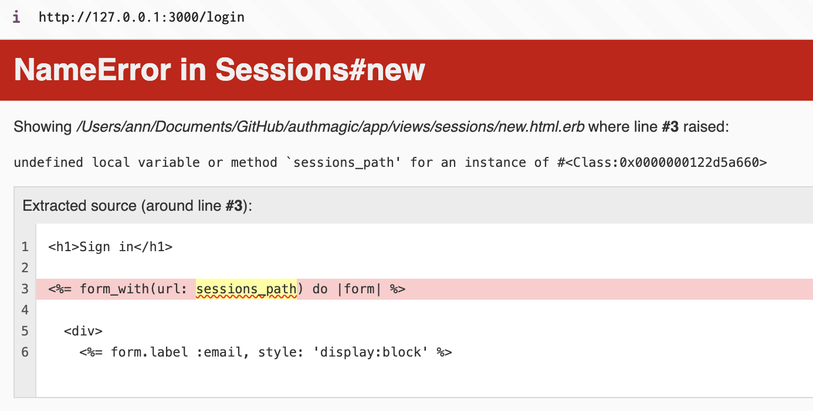
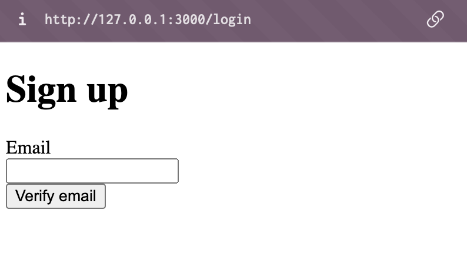

## Intro

I find passwordless authentication to be a better alternative to normal authentication with login and password because it really annoys me every time to generate and save a new password. So I am always looking for better alternatives. For example, social authentication. I wrote about it [here](how-to-setup-google-login-with-ruby-on-rails).

This particular method is another way to request registration via email, inspired by the [**authentication-zero library**](https://github.com/lazaronixon/authentication-zero/), but I've made it simpler and more straightforward.

For this tutorial, I aim to provide an extensive explanation, addressing the questions I've posed to myself, much like I would ask a teacher while learning.

## The Difference Between Authentication and Authorization

Actually, even I thought these two words were synonymous... But it turned out to be like bricks, layers of the security system of your application.

**Authentication: Who Are You?**

Imagine your application is a nightclub. Authentication is like checking IDs at the door. The bouncer verifies the ID (username and password) to confirm you are who you say you are. If your ID is valid, you're authenticated and allowed to enter.

Authentication involves verifying user credentials during login or registration. Rails provides features like user models and password hashing to securely handle this process.

**Authorization: What Can You Do?**

Now that you're inside the club (authenticated), authorization determines what privileges you have. In the club, maybe VIPs have a separate area. Here, authorization checks if you have the necessary permissions (VIP status) to access specific areas or features.

In Rails, authorization involves defining rules and assigning roles to users. You can then use middleware or gates to restrict access to routes or functionalities based on these permissions.

**Analogy Together: Security Layers**

Think of authentication and authorization as two security layers working together. Authentication verifies the user identity (like the ID check), and authorization determines what actions this authenticated user can take within the system (like VIP access). Both are crucial for securing your Rails application.

## The algorithm

Let's first understand the algorithm from both sides before we jump into implementation. For us, there is no difference between registration and login, which is another big plus for the passwordless method.

The logic of passwordless authentication from the user's perspective is as follows:

1. A user attempts to access a page restricted to unregistered users.
2. The user is redirected to the "login" page.
3. On the login page, the user enters their email address.
4. After submitting the email address, the user receives an email containing a magic link.
5. The user clicks on the magic link in the email, which authorizes them.
6. Upon authorization, the user is redirected to the necessary page for registered users.
7. Then we also need to handle the logout case.

From the Ruby on Rails developer perspective, the algorithm looks as follows:

1. We need 3 models for our auth: User, SignInToken, and Session.
2. The User model will only need an email (no password).
3. SignInToken is a token needed only for the verification process. It will appear in the email in the form of a magic link and should be deleted after the user successfully uses this link for login.
4. The Session model will handle the user's current session once they've successfully authenticated using the magic link sent to their email.
5. When a user requests to login (by clicking the button "Send email"), we generate a unique token (the SignInToken) and send it to the email address in the following format: `http://yourapp.com/verify?sid=SignInToken`.
6. The user clicks on the magic link in the email, which directs them back to our application with the token embedded in the URL.
7. Upon receiving the request with the token, we validate it against the corresponding record in the SignInToken model. If the token is valid and hasn't expired, we proceed to create a new session for the user.
8. Once the session is created, the user is considered authenticated and is redirected to the page for authenticated users.
9. Then we implement the method of authorization so that we can restrict unverified users from accessing certain pages.
10. Similarly, we implement the logout method.

## Implementation. Authentication and writing cookies

Let's start by making necessary models for our auth: User, SignInToken and Session.

```bash
rails g model user email:string
```

```bash
rails g model session user:references
```

```bash
rails g model sign_in_token user:references
```

In User model we need to add the following code:

```ruby
# models/user.rb
class User < ApplicationRecord
  has_many :sessions, dependent: :destroy
  has_many :sign_in_tokens, dependent: :destroy

  validates :email, presence: true, uniqueness: true, format: { with: URI::MailTo::EMAIL_REGEXP }

  normalizes :email, with: -> { _1.strip.downcase }
end
```

To start, we define the connections between users and their sessions, as well as their sign-in tokens. These associations ensure that when a user account is deleted, any associated sessions or tokens are also removed, keeping our database tidy and secure.

Next, we enforce email validation by checking for its presence, uniqueness, and correct format.

Lastly, we normalize the email addresses to a consistent format. By removing extra spaces and converting all characters to lowercase, we guarantee uniformity across user entries, simplifying future data management tasks.

Next we need to create a Session controller and here will be the main logic of our auth.

```bash
rails g controller sessions new create verify destroy
```

Now, before we begin updating the controller, let's add a route to our login page `get 'login' => 'sessions#new', as: :login` and your routes.rb file should look like this:

```ruby
# routes.rb
Rails.application.routes.draw do
  get 'sessions/new'
  get 'sessions/create'
  get 'sessions/verify'
  get 'sessions/destroy'

  # We added the route for login
  get 'login' => 'sessions#new', as: :login

  get 'up' => 'rails/health#show', as: :rails_health_check
end
```

Then let's open our controller and add the auth magic(create method):

```ruby
# controllers/sessions_controller.rb

class SessionsController < ApplicationController
  def new
  end

  def create
    user = User.find_or_create_by(email: params[:email])
    # TODO: Add send email logic
    redirect_to login_path, notice: "Check your email for a link to sign in"
  end

  def verify
  end

  def destroy
  end
end
```

The `create` method is triggered when the user fills out the form with their email and clicks the "Verify email" button.

Firstly, using the `find_or_create_by` method, we attempt to locate a user in the database based on the email address provided in the request parameters (`params[:email]`). If a user with that email address already exists, it is assigned to the user variable.

If no user is found, a new user record is created. The new user's email address is set based on the value in `params[:email]`.

Next, we should send an email with a special link to the user's email address. However, since we haven't generated a Mailer for our user yet, we will add this to our TODO list for now.

Finally, we utilize the `redirect_to` helper method to render a notice message if the email is sent correctly.

Now it's time to create our user Mailer. In terminal generate:

```bash
rails g mailer User passwordless
```

There will be created 3 files: `mailers/user_mailer.rb`, `views/user_mailer/passwordless.html.erb` and `views/user_mailer/passwordless.text.erb`

Go to the UserMailer file and let's write the email logic.

```ruby
# mailers/user_mailer.rb

class UserMailer < ApplicationMailer
  def passwordless
    @user = params[:user]
    @signed_id = @user.sign_in_tokens.create.signed_id(expires_in: 1.day)

    mail to: @user.email, subject: 'Your sign in link'
  end
end
```

Here, we retrieve the user from the database based on the email provided in the request parameters (`params[:user]`).

We also create a new instance of SignInToken for the user and hash it using the public method `signed_id`. This signed id is tamper-proof, making it safe to send in an email or share with the outside world. It can be set to expire (the default is not to expire) and scoped down with a specific purpose. If the expiration date has been exceeded before `find_signed` is called, the id won’t find the designated record.

This is essentially the magic of Ruby on Rails. It handles all encryption by itself, allowing us to simply use the `signed_id` in our email. To verify this hashed token, we'll need to use another public method, as you may guess, `find_signed`.

If you have a question like, "Where is this `signed_id` stored if our SignInToken model has nothing but `user:references`?"

Well, I had the same question, and the answer is, "it's not stored in the database at all." In fact, it's generated in the email itself and printed here just once.

Now that we've configured how our email should be generated, it's time to fix its view.

```erb
<%# views/user_mailer/passwordless.html.erb %>

<p>Hey there,</p>

<p>You requested a magic sign-in link. Here you go:</p>

<p><%= link_to "Sign in without password", verify_sessions_url(sid: @signed_id) %></p>
```

In the email, as you can see, we generate the URL based on the verify method of our session controller (which is defined but has no logic inside yet, but it will soon). And at the end of the URL, there will be a hash that we defined in the previous step, `(sid: @signed_id)`.

Now let's go to our sessions_controller and write the verify method and fix our TODO!

```ruby
# controllers/sessions_controller.rb

class SessionsController < ApplicationController
  def new; end

  def create
    User.find_or_create_by(email: params[:email])
    # replace TODO with actual email
    UserMailer.with(user:).passwordless.deliver_later
    redirect_to login_path, notice: 'Check your email for a link to sign in'
  end

  # add this method
   def verify
    begin
      user = SignInToken.find_signed!(params[:sid]).user
    rescue StandardError
      redirect_to(login_path, alert: 'Invalid or expired token')
      return
    end
    session_record = user.sessions.create!
    cookies.signed.permanent[:session_token] = { value: session_record.id, httponly: true }
    user.sign_in_tokens.delete_all
    redirect_to root_path, notice: 'Successfully signed in'
  end

  def destroy; end
end
```

First of all, we added UserMailer in the `create` method since we added the mailer and the email view.

Secondly, we added the `verify` method. Here is the breakdown of what is happening here line by line:

- First, we validate the token that was passed through email. As I already mentioned, to validate something that has a signed_id, we use the `find_signed` method. This way, we find the user associated with the token.
- Also, we handle invalid and expired tokens under `rescue StandardError`. If the token is valid, a new Session record is created and associated with the user (`session_record`). This session record will be used to identify the user's authenticated state.
- Now, cookies. We set a signed, permanent cookie named `session_token` with the value of the newly created session record's ID. The `httponly: true` option ensures that the cookie can only be accessed by the server, preventing client-side scripts from reading or modifying the cookie.
- After checking the token and creating the session, we delete all the SignInToken records associated with the user using the `delete_all` method. This step is typically done for security reasons, as it ensures that any previously issued tokens are invalidated after successful login.
- Finally, the user is redirected to the `root_path` (or any other path of your choice for logged-in users) with a notice message indicating that the sign-in process was successful.

I don't have a `root_path` just yet, so I created Home controller and `home#index` path. To make this tutorial somewhat shorter, I'll skip these steps with creating the Home controller and view. Hopefully, you won't have a hard time going through this step on your own. Then, I add the home route to the `routes.rb` file:

```ruby
# routes.rb

Rails.application.routes.draw do
  get 'sessions/new'
  get 'sessions/create'
  get 'sessions/verify'
  get 'sessions/destroy'

  get 'login' => 'sessions#new', as: :login
  get 'up' => 'rails/health#show', as: :rails_health_check

  # add root page
  root 'home#index'
end
```

And the last thing we have to setup is :host parameter in `config/environments/development.rb` and in the future specify the host in `config/environments/production.rb`:

```ruby
Rails.application.routes.default_url_options[:host] = 'localhost:3000'

```

So here we should stop and think... as we've basically created an authentication system with email, it should work, and we can check it somehow. The last thing is to create a view with the basic auth form:

```erb
<%# views/sessions/new.html.erb %>

<h1>Sign in</h1>

<%= form_with(url: sessions_path) do |form| %>

  <div>
    <%= form.label :email, style: 'display:block' %>
    <%= form.email_field :email, required: true, autofocus: true %>
  </div>

  <div>
    <%= form.submit "Verify email" %>
  </div>
<% end %>
```

Now I think we've finished about 2/3 of our main task. We can now run the server and check the login page.

```bash
bin/rails s
```

Oops, we've just encountered an error.



It happens because we haven't properly defined the routes in our application. Let's fix it.

```ruby
# routes.rb

Rails.application.routes.draw do
  get 'login' => 'sessions#new', as: :login
  get 'up' => 'rails/health#show', as: :rails_health_check

  # define sessions_path
  resources :sessions, only: %i[create destroy] do
    get :verify, on: :collection
  end
  root 'home#index'
end
```

Here's what each part of the code does:

`resources :sessions, only: %i[create destroy]`: This line creates RESTful routes for the SessionsController, but it only creates the create and destroy actions. The `only` option is used to limit the routes to just these two actions.

`get :verify, on: :collection`: This line defines an additional route for the verify action in the SessionsController. The `on: :collection` option specifies that this action is a collection route, meaning it doesn't require an ID parameter.

By defining these routes, Rails automatically generates several route helpers, including:

- `sessions_path`: This helper corresponds to the path for the create action, which is typically used for submitting a new session (logging in).
- `session_path(id)`: This helper corresponds to the path for the destroy action, which is typically used for logging out. It requires an id parameter.
- `verify_sessions_path`: This helper corresponds to the path for the verify action, which you defined as a collection route.

When you use `<%= form_with(url: sessions_path) %>` in your view, Rails knows to generate the correct URL for the create action of the SessionsController because you defined the `resources :sessions` routes.

By properly defining the routes for your SessionsController, Rails can generate the necessary route helpers, including `sessions_path`, which resolves the undefined local variable or method 'sessions_path' error you were encountering.

Now, if we go to `127.0.0.1:3000/login`, we should see our login page.



And now, if we enter an email and receive the verification link, we should be logged in and redirected to the path for authenticated users.

## Authorization and reading cookies

For now, all our application is accessible by anyone by default. So our task for now is to restrict access to the `root_path` and redirect the user to the login page until verification.

We need to know whether the user is authenticated or not. We can do this by checking the presence (or actually reading) of a session cookie. Navigate to the ApplicationController and add the following code:

```ruby
# controllers/application_controller.rb

class ApplicationController < ActionController::Base
  before_action :authenticate

  private

  def authenticate
    if (session_record = Session.find_by(id: cookies.signed[:session_token]))
      Current.session = session_record
    else
      redirect_to login_path
    end
  end
end
```

On the application level, we define the method `authenticate`, where we read cookies and assign a session if present; otherwise, the user will be redirected to the login page.

To make this work, I utilize the `Current` class. This is a custom class used to store and manage global data (data that needs to be accessible from anywhere in the application).
You need to create a new file in the `models` folder called `current.rb` and add this code:

```ruby
# models/current.rb

class Current < ActiveSupport::CurrentAttributes
  attribute :session
  delegate :user, to: :session, allow_nil: true
end
```

By assigning the `session_record` to `Current.session` in ApplicationController, you're making that session object available throughout the application, thanks to the `Current` class you defined earlier. Since you also delegated the `user` method to the `session` attribute in the `Current` class (`delegate :user, to: :session, allow_nil: true`), you can now access the user associated with the current session by calling `Current.user` from anywhere in your application.

One last thing is to add `before_action` where it is necessary.

```ruby
# controllers/home_controller.rb
class HomeController < ApplicationController
  before_action :authenticate

  def index; end
end
```

And we also need to skip before_action where the authentication is required.

```ruby
# controllers/sessions_controller.rb

class SessionsController < ApplicationController
  skip_before_action :authenticate, only: %i[new create verify]

# rest of the code

```

Now, if we reload our Rails server and delete cookies, then try to access the home page, we will be redirected to the login page. Once we log in, we will be able to access the home page.

The last part of this article will be the shortest one: how to log out from our app.

## Delete sessions and cookies

To delete the session from the database and log out the user, we need to write our `destroy` method in our `sessions_controller`.

```ruby
# controllers/sessions_controller.rb

 def destroy
    Current.user.sessions.find(params[:id]).destroy

    redirect_to(login_path, notice: "You're logged out")
  end
```

As we now have a Current helper, we know who this current user is and whose session we should destroy.

Now let's write a simple logout button right on our index#home page.

```ruby
# views/home/index.html.erb
<%= button_to "Log Out", session_path(Current.session), method: :delete, class: "btn btn-danger" %>
```

That's it! Test it out. Log in and log out should work as expected. Now with the same logic you can add a list of sessions and make it possible to delete any session of your user, not only the current one.

I also leave the authmagic code [here](https://github.com/kotogavr/authmagic) for you reference.

Happy coding!
