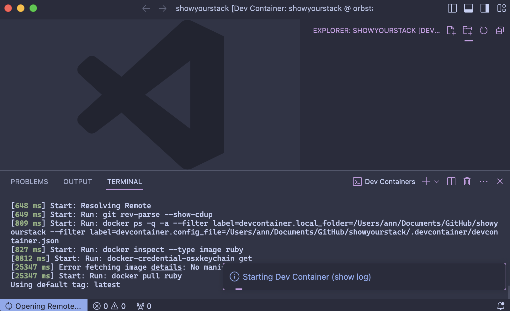

## Why to program in containers?

I believe you're familiar with the pain of dealing with
unnecessary files and dependencies cluttering your computer when you're programming on
Ruby on Rails. This is such a problem that I even come across on paid services that claim to set up a Ruby on Rails project for you.

Fortunately, there's a solution to this problem, commonly known as an isolated environment.
You might assume that containers are only meant for production environments,
or as a beginner, you may think that setting up an isolated environment would complicate
things to the point where finding documentation to make your code work becomes a daunting task.
No need to worry, I shared the same concerns!

> Containers are good for dev environment. Containers are good for begginers.

## Types of isolated environments

Firstly, let's understand that **there are two types of isolated environments:
virtual machines (VMs) and containers**.

VMs are more like a computer inside a computer, and containers are more
like a process inside a computer.
The primary distinction is that VMs have their own kernel, and containers share the
kernel with the host machine. This means that containers are more lightweight and
faster than VMs. VMs are employed for running different operating systems on the same
machine, whereas containers are used for running different processes on the same
operating system. In this context, we won't delve into VMs; instead, we will focus on
containers, particularly [Development Containers](https://containers.dev/).

## Setting up a devcontainer in VSCode

Typically, I manually set up a devcontainer.
You might wonder why I don't use the devcontainer setup provided in VSCode.
The reason is simple: it installs unnecessary extensions and files that are not needed,
and removing them isn't straightforward.

For example, if you choose a Ruby on Rails devcontainer, it might install Node.js and Python.
🤔 I don't know why, maybe just in case!

To circumvent this, I'll guide you on setting up a clean and lightweight devcontainer
specifically tailored for Ruby on Rails development.

First of all, install our [Dev Container Extension for VSCode](https://marketplace.visualstudio.com/items?itemName=ms-vscode-remote.remote-containers).

And now we start with making new directory:

```bash
mkdir my-rails-app
cd my-rails-app
```

Inside the directory create .devcontainer folder:

```bash
mkdir .devcontainer
cd .devcontainer
```

Inside .devcontianer folder create devcontainer.json file:

```bash
touch devcontainer.json
```

and then add this basic information:

```json
{
  "build": {
    "dockerfile": "Dockerfile"
  },
  "customizations": {
    "vscode": {
      "extensions": [
        "Shopify.ruby-lsp",
        "castwide.solargraph",
        "kaiwood.endwise"
      ]
    }
  },
  "name": "My RoR project",
  "postCreateCommand": "bundle",
  "runArgs": ["--name", "my-ror-project"],
  "workspaceFolder": "/workspaces/${localWorkspaceFolderBasename}"
}
```

Curious about the `customizations` section?
This is where you can specify the extensions you want to install in your devcontainer.
In this case, we've added the **Ruby LSP**, **Solargraph**, and **Endwise** extensions.
I talk about the first two in [this article](best-workflow-to-create-ruby-on-rails-project).
Endwise is a simple extension that automatically adds "end" after "do" or "if" statements in Ruby.

Now Inside .devcontianer create also Dockerfile:

```bash
touch Dockerfile
```

Here we will need only:

```Dockerfile
FROM ruby
```

### Setting Up PostgreSQL Database in Devcontainer

_Skip this if you don't want to use PostgreSQL_.

If you want to utilize a PostgreSQL database in your project, you'll need to create new file:

```bash
touch docker-compose.yml
```

and add this basic information. Since we're working with containers and PostgreSQL,
we add `db:` to ensure that our Rails container can 'recognize' our database container:

```yaml
version: "3"

services:
  app:
    build:
      context: ..
      dockerfile: .devcontainer/Dockerfile

    volumes:
      - ../..:/workspaces:cached

    command: sleep infinity

    network_mode: service:db

  db:
    image: postgres:alpine
    volumes:
      - db-data:/var/lib/postgresql/data
    environment:
      POSTGRES_USER: postgres
      POSTGRES_DB: postgres
      POSTGRES_PASSWORD: postgres
```

As we setup our environment we have to run our project in a container using Containerization Platform

## Installing Containerization Platform

To run your project in a container on Windows, you'll need to have Docker Desktop installed.
However, if you're a MacOS user, I've got an excellent lightweight alternative for you
called [OrbStack](https://orbstack.dev/). It's free for personal use, and you can compare
it with Docker Desktop on their [website](https://docs.orbstack.dev/compare/docker-desktop).

## Running the Project in a Container and Setting Up Database

Now that we've configured our Containerization Platform, reload VSCode with your
`my-rails-app`, and you'll be prompted to reopen it in a container.
Click on "Reopen in Container. Your devcontainer will start loading and
it may take a few minutes to complete. Here is the example
below of how it looks like when it's loading:



Once the devcontainer is loaded, you'll be prompted to click any button to continue.
Click and open new terminal. You can successfully close this Dev Containers window.

If you open a terminal, you'll see something like this:

```bash
xxxx@xxxxxxxxxxxxxx:/workspaces/my-rails-app#
```

It means that you are operating inside the container. Perfect!
Now in our container we have only ruby installed.
We need to install Rails:

```bash
gem i rails
```

And create a new project:

```bash
rails new -c tailwind . -d postgresql
```

Note that we used a dot (.) instead of providing your repo name.
This is because we've already created the folder, and we're generating the project within
this existing folder.

This was the final step for those who don't plan
to use PostgreSQL. You can now start developing your Ruby on Rails project.

If you want to use PostgreSQL,
in the `database.yml` file, locate the "development"
section and uncomment the lines for "database,"
"username," "password," and "host."
Mirror the structure provided in the example.
Be sure to replace the default names with those specified in the docker-compose.yml file above.

```yaml
development:
  <<: *default
  database: postgres

  # The specified database role being used to connect to postgres.
  # To create additional roles in postgres see `$ createuser --help`.
  # When left blank, postgres will use the default role. This is
  # the same name as the operating system user running Rails.
  username: postgres

  # The password associated with the postgres role (username).
  password: postgres

  # Connect on a TCP socket. Omitted by default since the client uses a
  # domain socket that doesn't need configuration. Windows does not have
  # domain sockets, so uncomment these lines.
  host: db
```

Perfect! Now we are ready to launch and start developing. Run this command, and here we go!

```bash
bin\rails s
```

## Conclusion

In conclusion, we've successfully navigated the process of setting up
a clean and lightweight development environment for Ruby on Rails using containers.
By understanding the distinctions between virtual machines and containers, manually
configuring a devcontainer, and making necessary adjustments for PostgreSQL integration,
we've paved the way for efficient and streamlined development.

Remember, whether you choose Docker Desktop on Windows or explore the lightweight
alternative OrbStack for MacOS, the goal is to create an isolated environment tailored
to your project's needs. All your gems, dependencies, and extensions are contained and never
harm your PC's performance.

If you encounter any challenges or have further questions, feel free to reach out. Happy coding!
